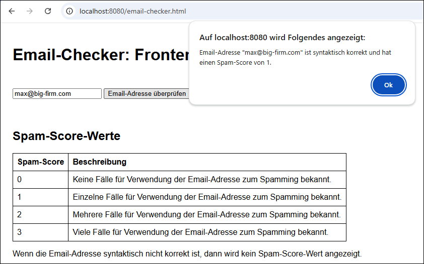

# Email-Checker mit Eureka-Server als Service Registry #

 

Dieses Repo enthält drei auf *Spring Boot* basierende Maven-Projekte, die zusammen einen Email-Checker 
realisieren. Es soll damit *client-seitiges Load Balancing* unter Verwendung eines Eureka-Servers
als Service Registry demonstriert werden.

 

----

## Screenshot

 

 

---

## Services und Port-Nummern ##

 

Die Reihenfolge in der folgenden Tabelle ist auch die empfohlene Startreihenfolge.

 

| Name                    | Port-Nummer                   | Unterordner                  |
| ----------------------- | ----------------------------- | ---------------------------- |
| Eureka Service Registry | [8761](http://localhost:8761) | [1_registry/](1_registry/)   |
| Spam-Score-API #1       | [8010](http://localhost:8010) | [2_spamscore/](2_spamscore/) |
| Spam-Score-API #2       | [8020](http://localhost:8020) |                              |
| Frontend                | [8080](http://localhost:8080) | [3_frontend/](3_frontend/)   |

 
